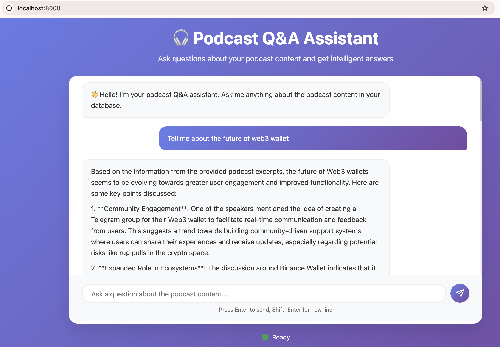

# Podcast Q&A Assistant (RAG)

A streamlined Retrieval‑Augmented Generation (RAG) app for asking questions about your podcast content and getting grounded, source‑attributed answers. It uses FastAPI, a vector database (Qdrant), sentence‑transformers for embeddings, and an LLM for answer synthesis.



## Features

- Clean chat UI with source attributions
- Fast similarity search via Qdrant
- Multilingual embeddings (English/Chinese)
- Health endpoint for quick diagnostics
- Simple ingestion path for your own content

## Architecture

```
Frontend (HTML/CSS/JS) ⇄ FastAPI Backend ⇄ Qdrant Vector DB
                                  ↓
                               LLM API
```

## Project Layout

```
RAG Project/
├── backend/                # FastAPI + RAG service
│   ├── main.py             # API routes
│   ├── rag_service.py      # Retrieval & answer orchestration
│   └── config.py           # Env/config handling
├── frontend/               # Static UI assets
│   ├── index.html
│   ├── style.css
│   └── script.js
├── qdrant_data/            # Optional local data (e.g., chunks.pkl)
├── qdrant_storage/         # Qdrant persistent storage (if running containerized)
├── docker-compose.yml
├── requirements.txt
├── .env / .env.example
└── README.md
```

## Quick Start (Docker Compose)

- Ensure you have Docker installed.
- Set your environment variables in `.env` (see below).
- Start the app:

```bash
docker compose up -d
```

Open `http://localhost:8000/` to use the UI.

### Health & Retrieval Checks

- Health: `curl -s http://localhost:8000/api/health`
- Retrieval-only: `curl -s "http://localhost:8000/api/search?query=web3%20wallet&limit=5"`
- Chat: `curl -s -X POST http://localhost:8000/api/chat -H "Content-Type: application/json" -d '{"query":"web3 wallet","limit":5}'`

## Configuration

Set via `.env` or environment:

- `OPENAI_API_KEY` — OpenAI API key
- `QDRANT_HOST` — Qdrant host (default in compose: `host.docker.internal`)
- `QDRANT_PORT` — Qdrant port (default `6333`)
- `COLLECTION_NAME` — default `podcast_chunks`
- `EMBEDDING_MODEL` — `paraphrase-multilingual-MiniLM-L12-v2`
- `LLM_MODEL` — e.g., `gpt-4o-mini`

Note: The compose is configured to talk to the host Qdrant (`host.docker.internal`). If you prefer the containerized Qdrant service, set `QDRANT_HOST=qdrant` and ensure the `qdrant` service is running and the app depends on it.

## Ingest Your Content

You can ingest your own chunks into Qdrant using the provided script:

```bash
docker compose exec app python backend/ingest_qdrant.py
```

Place your prepared data (e.g., `chunks.pkl`) in `qdrant_data/` before running the ingestion. The script will ensure the collection exists and upsert embeddings.

## API Overview

- `POST /api/chat` — Ask a question; returns answer with sources
- `GET /api/search` — Retrieval only; returns similar chunks
- `GET /api/health` — Service diagnostics and component statuses

## Development

- Hot reload backend locally:

```bash
cd backend
python -m uvicorn main:app --reload --host localhost --port 8000
```

- Frontend is served as static files by the backend at `/`.

## Troubleshooting

- No results or irrelevant sources:
  - Verify your Qdrant instance is populated with your content
  - Check `COLLECTION_NAME` and the host/port settings
- Health shows deferred components:
  - Some components initialize lazily; call endpoints to prime
- Switching Qdrant targets:
  - Host Qdrant: set `QDRANT_HOST=host.docker.internal`
  - Container Qdrant: set `QDRANT_HOST=qdrant` and run the `qdrant` service

## GitHub Push (Quick Guide)

1. Initialize and commit:
   ```bash
   git init
   echo "__pycache__/\n*.pyc\n.qdrant_storage/\nqdrant_storage/\n.env\n" >> .gitignore
   git add .
   git commit -m "Initial commit: RAG Podcast Q&A Assistant"
   ```
2. Add remote and push:
   ```bash
   git branch -M main
   git remote add origin <YOUR_GITHUB_REPO_URL>
   git push -u origin main
   ```

> Tip: Do not commit secrets. Keep `.env` out of version control.